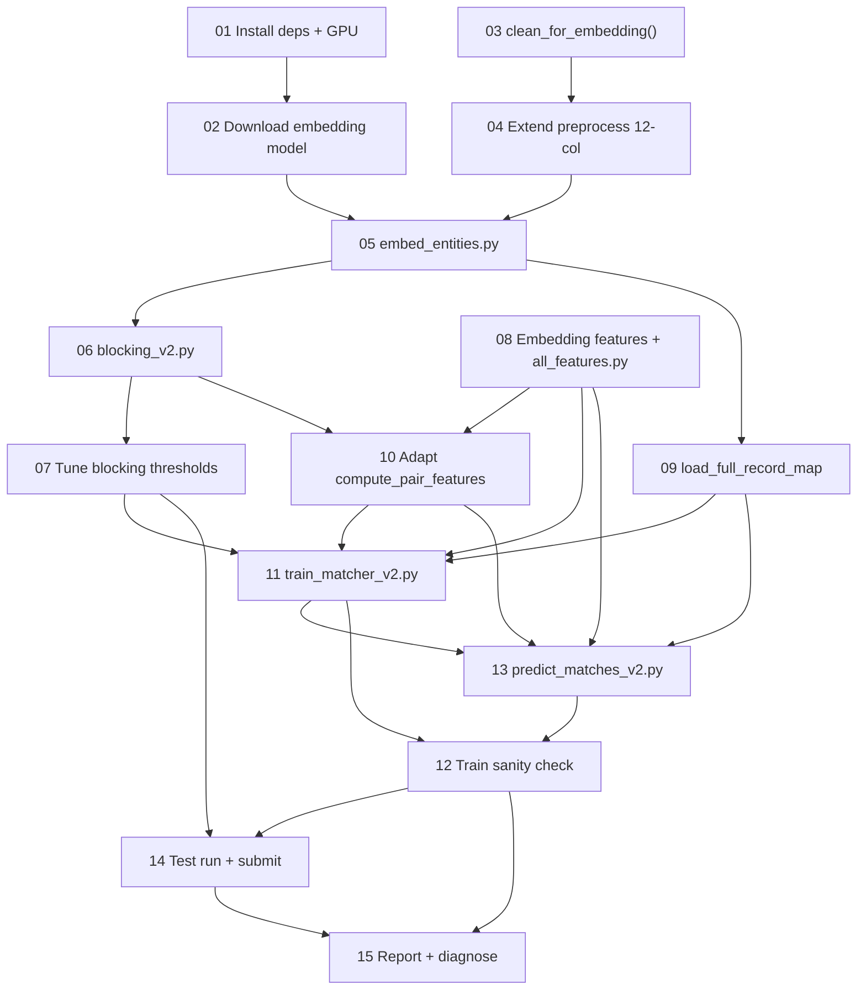

# Embedding-Based Entity Resolution Pipeline — Ticket Index

Target: F0.5 > 99% on Unstop held-out test set.
Hardware: RTX 3050 Ti (4GB VRAM), 16GB DDR4, 8-core i7 11th gen.

## Dependency Graph

## Tickets

| # | Title | Blocked by | Stage |
|---|-------|-----------|-------|
| 01 | Install deps + validate GPU | — | 0 |
| 02 | Download & validate embedding model | 01 | 0 |
| 03 | Add `clean_for_embedding()` | — | 1 |
| 04 | Extend preprocess to 12 columns | 03 | 1 |
| 05 | Create `embed_entities.py` | 02, 04 | 2 |
| 06 | Create `blocking_v2.py` (FAISS exact) | 05 | 2 |
| 07 | Tune blocking thresholds | 06 | 2 |
| 08 | Add embedding features + `all_features.py` | — | 3 |
| 09 | Create `load_full_record_map` | 05 | 3 |
| 10 | Adapt `compute_pair_features` for v2 | 08, 06 | 3 |
| 11 | Create `train_matcher_v2.py` (5-fold CV) | 07, 09, 10, 08 | 4 |
| 12 | Validate train-split prediction | 11, 13 | 6 |
| 13 | Create `predict_matches_v2.py` | 11, 09, 10, 08 | 5 |
| 14 | Test split end-to-end + submit | 12, 07 | 6 |
| 15 | Report results + diagnose gap | 14, 12 | 6 |

## Parallelism opportunities

These sets can run concurrently:
- **Batch 1:** 01, 03, 08 (zero dependencies)
- **Batch 2:** 02 (needs 01), 04 (needs 03)
- **Batch 3:** 05 (needs 02+04), 09 (needs 05), 10 (needs 08+06)
- Remaining tickets are mostly serial (training → inference → submission)
